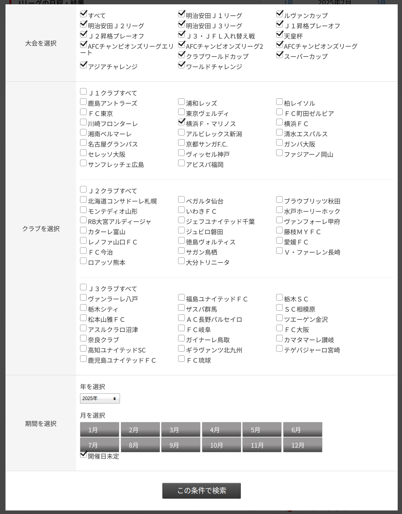

Jリーグ試合スケジュールのicsファイルを作成するpythonスクリプトです。  
icsファイル対応のカレンダーに読み込ませると、前日や数時間前にメールやポップアップで通知されます。  
詳しくはソースコード内を見て、自分用に調整して下さい。

## 環境設定

Linuxで動作確認済みです。他のOSは適宜読み替えて下さい。

```bash
git clone https://github.com/takahashimasaki4biz/j-schedule-ics-maker.git
cd j-schedule-ics-maker
chmod +x j-schedule-ics-maker.py
python3 -m venv .venv
. .venv/bin/activate
pip3 install -r requirements.txt
deactivate
```

## 下記手順でURLをメモる

https://www.jleague.jp/match/ の 上の方にある **[条件で絞り込む]** ボタンを押すと、下記の様な選択のダイアログが表示される。
- 大会を選択 → 「すべて」のチェックボックスをONする
- クラブを選択 → 応援しているクラブのチェックボックスをONする
- 期間を選択 → 念の為「年」を確認。1月〜12月のボタンを全て押す。開催日未定のチェックボックスもONしておく
- [この条件で検索] する → 検索結果のページが開かれるので、そのURLをメモっておく



## icsファイルを作成しカレンダーに設定する

```bash
cd j-schedule-ics-maker
. .venv/bin/activate

./j-schedule-ics-maker.py "https://www.jleague.jp/match/search/(中略。上記手順でメモしたURL)"
```

数分待つと、 j-schedule-ics-maker.ics ファイルが生成されているはずです。  
このファイルをicsファイル対応のカレンダーに読み込ませて下さい（それぞれ手順が違うと思うので詳しく書きません）。
最後に下記でpython仮想環境を後始末します。

```bash
deactivate
exit
```

## その他

何かうまくいかった場合は、カレンダーを削除＆再作成して、やりなおして下さい。  
（なので、専用のカレンダーを作った方が良いでしょう。まるごと削除して、再作成すれば良いです）
